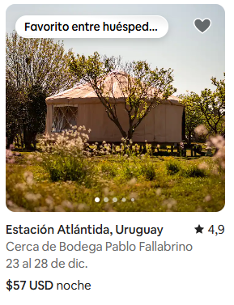

# Maquetación card Airbnb

En este ejercicio vamos a desarrollar la maquetación de una card de un alojamiento de Airbnb utilizando HTML y CSS.

## Objetivos

- Afianzar los conocimientos de HTML y CSS, aprendiendo diferentes formas de posicionamiento y display
- Aprender a desplegar en producción una página web
- Aprender a validar la calidad de un proyecto con SonarCloud

## Diseño

El diseño de la card será el siguiente:

## Aclaraciones

- La card debe tener un ancho máximo de 320px
- Aunque sea imposible que quede exactamente igual, se debe maquetar lo más cercano posible a la imagen
- La fuente utilizada puede ser `Arial` o `sans-serif`
- El contenedor de la card no tiene bordes
- El subtitulo y las fechas deben tener un color `grey` o `#eee`
- La imagen de la casa se puede descargar [aquí](../imgs/house-airbnb.webp). Ya que es una imagen con un ratio de aspecto muy diferente, debemos ajustarla con la propiedad [`object-fit`](https://developer.mozilla.org/en-US/docs/Web/CSS/object-fit)
- Los iconos se pueden obtener de [Font Awesome](https://fontawesome.com/icons?d=gallery)
  - [Icono heart](https://fontawesome.com/icons/heart?f=classic&s=regular)
  - [Icono star](https://fontawesome.com/icons/star?f=classic&s=solid)

## Entrega

El ejercicio se debe entregar antes del sábado 23 de Noviembre a las 23:59, en la entrega habilitada en classroom para ello.
