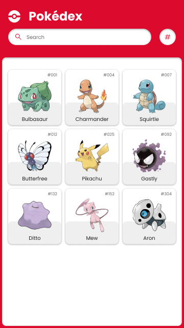

# Pokedex no code

El objetivo es realizar un proyecto de una Pokédex. En este primer ejercicio nos vamos a encargar de la maquetación de la página web.

La aplicación constará de una página principal con un listado de pokemons y cada uno de ellos tendrá una página de detalle.

## Diseños

El diseño de la aplicación nos vendrá dado por el siguiente [archivo de Figma](https://www.figma.com/community/file/979132880663340794).

## Pasos a seguir

1. Crear un repositorio en Github con el nombre `hello-pokedex`. Clonar el repositorio en vuesto ordenador.
2. Crear un archivo `index.html` y otro `detail.html` en la raíz del proyecto.
3. Crear una carpeta `css` y dentro de ella un archivo `styles.css`.
4. Realizar la maquetación de la página principal.

> [!NOTE]
> En este primer ejercicio no es necesario utilizar JS. Solo HTML y CSS.

5. Despliega la página web en producción con [Netlify](https://www.netlify.com/blog/2016/09/29/a-step-by-step-guide-deploying-on-netlify/)
6. (Opcional) Realizar la maquetación de la página de detalle, eligiendo sólo 1 de los pokemon que hay en el diseño
