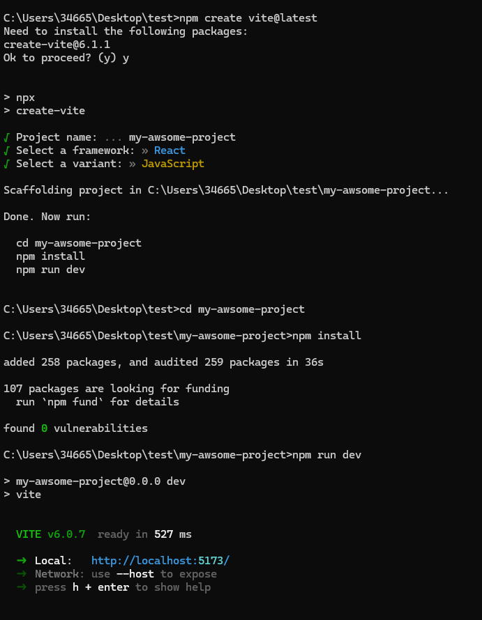

# Programando Tic Tac Toe

Para poder familiarizarte con los conceptos de React, su propia documentación tiene un tutorial _learning by doing_ que ayuda mucho a introducirse en React.

React no es más que una librería que nos **libera de gestionar practicamente las API's del DOM** de JS (_querySelector_, _createElement_, _appendChild_), es decir, es como si nos diese la función render que teníamos en las anteriores clases.

Además ReactJS propone la creación de **aplicaciones basada en componentes** reutilizables, lo que nos va a permitir mejorar nuestra velocidad de desarrollo. React añade a estos componentes un **ciclo de vida** para que podamos gestionar cómo y cuando un componente se tiene que actualizar visualmente (re-renderizar).

## pre-requisitos

- [NodeJS v20](https://nodejs.org/en) o superior

## Empezando el tutorial

1. Navegamos al [tutorial](https://18.react.dev/learn/tutorial-tic-tac-toe) y realizamos el setup como hemos visto en clase, utilizando [**vite**](https://vite.dev/guide/) y **NO** descargando el code-sandbox, ya que nos permite acostumbrarnos a la configuracón de un entorno empresarial.

   

2. Cambiaremos el contenido de nuestro `App.jsx` por el componente **Square** que indica en el tutorial y empezaremos a crear el Tres en Raya.

3. Debemos subir el proyecto a Github, configurar el proyecto con Sonar y desplegarlo a Netlify, utilizando la metodología vista en clase.

> [!NOTE]
> Se puede dividir las ramas por las diferentes secciones del tutorial

4. Como extra, **implementar un contador de victorias de cada jugador**.
