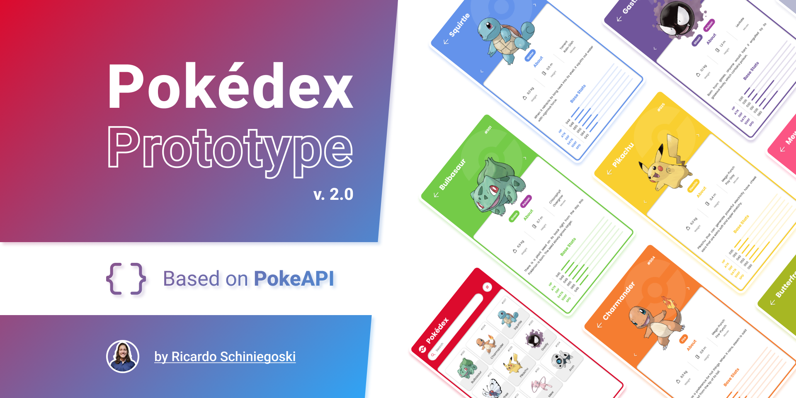
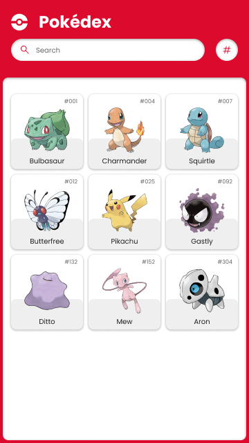

# Pokedex

El objetivo es realizar un proyecto de una Pokédex.

## Diseños

El diseño de la aplicación nos vendrá dado por el siguiente [archivo de Figma](https://www.figma.com/community/file/979132880663340794).

## Primeros pasos con el proyecto. La maquetación

En esta primera parte nos vamos a encargar de la maquetación de la página web. Cuando nos enfrentamos a un nuevo proyecto, o funcionalidad dentro de uno existente, un buen punto de partida sería la maquetación de la interfaz sin recibir datos de ningún servidor, simplemente mostrando datos fijos.

La aplicación constará de una página principal con un listado de pokemons y cada uno de ellos tendrá una página de detalle.

### Guía orientativa de pasos a seguir

1. Crear un repositorio en Github con el nombre `ux-engineer-pokedex-[Nombre_del_grupo]`. Debemos incluir el LICENSE, README.md y el `.gitignore de node`. Clonar el repositorio en vuesto ordenador.
2. Crear nuestra carpeta `src` y un archivo `index.html` y otro `detail.html` dentro de ella.
3. Crear una carpeta `styles` dentro de src y dentro de ella un archivo `styles.css`.
4. Subir los cambios a Github como primer app commit.
5. Conectar el repositorio con [Netlify](https://www.netlify.com/blog/2016/09/29/a-step-by-step-guide-deploying-on-netlify/) para desplegar la página web y con SonarCloud para analizar el código.
6. Realizar la maquetación de la página principal. Debemos dividir en funcionalidades/cambios que aporten valor al usuario de la aplicación e ir atajando esos cambios de uno en uno. Por ejemplo, primero maquetar el header, luego la card de un pokemon, luego el footer, etc.

   

> [!NOTE]
> A la hora de enfocar la maquetación, mi consejo es que realicéis primero la estructura HTML y CSS de la funcionalidad que estás atacando y luego le añadamos el renderizado a través de las API's del DOM, con los datos del JS. Una vez que terminéis esa funcionalidad, lo repetiremos con las siguientes en bucle.

7. Realizar la maquetación de la página de detalle, eligiendo **sólo 1** de los pokemon que hay en el diseño.
